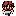
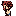
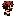
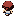
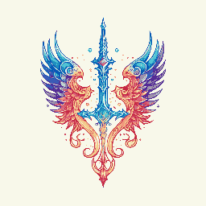
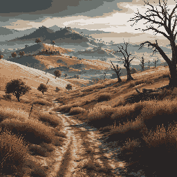
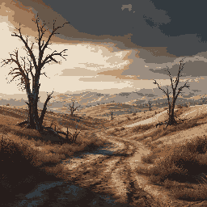

<h1 align = center>

 -- Asset Catalogue --

</h1>

----

| Asset Name | Type | Credit | Image |
|-----------|------|--------|-------|
| Player | Sprite | Hunter Singleton |<h1 align = center>         </h1> |
| Merchant | Sprite | Hunter Singleton |<h1 align = center>     </h1>|
| Goblin 1 | Sprite| Stephen Challener (Redshrike) |   |
| Goblin 2 | Sprite | Stephen Challener (Redshrike) |   |
| Goblin 3 | Sprite | Stephen Challener (Redshrike) |   |
| Goblin 4 | Sprite | Stephen Challener (Redshrike) |   |
| Goblin 5 | Sprite | Stephen Challener (Redshrike) |   |
| Goblin 6 | Sprite | Stephen Challener (Redshrike) |   |
| Goblin 7 | Sprite | Stephen Challener (Redshrike) |   |
| World Tileset | Tileset | Hunter Singleton |  |
| Goblin Title | Tileset | Hunter Singleton |  |
| Goblin Title Bckground | Tileset | Stable Diffusion |  |
| Battle Back 1 | Tileset | Stable Diffusion |  |
| Battle Back 2 | Tileset | Stable Diffusion |  |
| Title Theme | VGM | Hunter Singleton |  |
| Battle Theme | VGM | Hunter Singleton |  |
| World Theme | VGM | Hunter Singleton |  |
| Victory Fanfare | VGM | Hunter Singleton |  |
| Title Font | Font | Juan Pablo Reyes Altamirano |  |

 
Stephen Challener (Redshrike)

https://opengameart.org/content/10-basic-rpg-enemies-the-goblin-supplement

 
FF Font

https://www.dafont.com/final-fantasy.font

