<h1 align = center>

 -- Asset Catalogue --

</h1>

----

| Asset Name | Type | Credit | Image |
|-----------|------|--------|-------|
| Player | Sprite | Hunter Singleton |<h1 align = center> 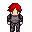 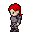 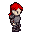 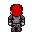 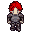 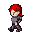 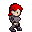 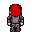 </h1> |
| Merchant | Sprite | Hunter Singleton |<h1 align = center> 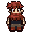 </h1>|
| Goblin 1 | Sprite| Stephen Challener (Redshrike) |   |
| Goblin 2 | Sprite | Stephen Challener (Redshrike) |   |
| Goblin 3 | Sprite | Stephen Challener (Redshrike) |   |
| Goblin 4 | Sprite | Stephen Challener (Redshrike) |   |
| Goblin 5 | Sprite | Stephen Challener (Redshrike) |   |
| Goblin 6 | Sprite | Stephen Challener (Redshrike) |   |
| Goblin 7 | Sprite | Stephen Challener (Redshrike) |   |
| World Tileset | Tileset | Hyptosis (Edited for Genesis by Hunter Singleton)| 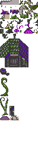 |
| Goblin Title | Tileset | Hunter Singleton | 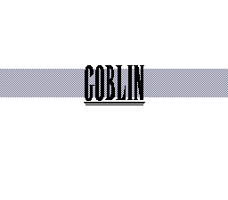 |
| Goblin Title Background | Tileset | Hunter Singleton| 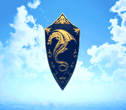 |
| Game Over Screen | Tileset | Hunter Singleton | 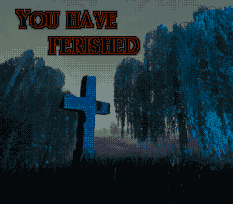 |
| Battle Back 1 | Tileset | Hunter Singleton| 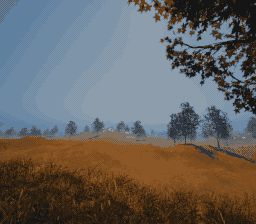 |
| Battle Back 2 | Tileset | Hunter Singleton| 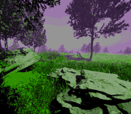 |
| Battle Back 3 | Tileset | Hunter Singleton| 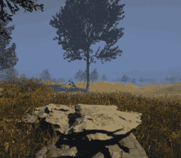 |
| Battle Back 4 | Tileset | Hunter Singleton| 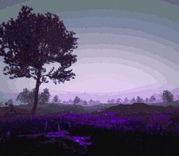 |
| Battle Back 5 | Tileset | Hunter Singleton| 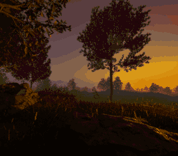 |
| Battle Back Cave 1| Tileset | Hunter Singleton| 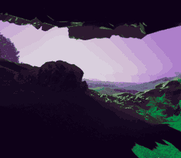 |
| Battle Back Cave 2| Tileset | Hunter Singleton| 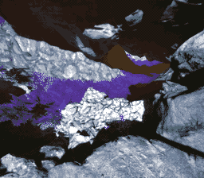 |
| Battle Back Cave 3 | Tileset | Hunter Singleton| 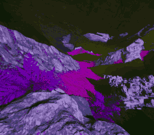 |
| Battle Back Cave 4 | Tileset | Hunter Singleton| 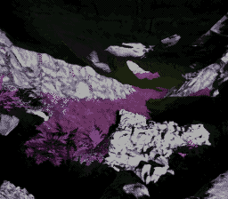 |
| Player Portrait | Tileset | Stable Diffusion | 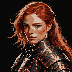 |
| Merchant Portrait | Tileset | Stable Diffusion |  |
| Title Theme | VGM | Hunter Singleton |  |
| Battle Theme | VGM | Hunter Singleton |  |
| World Theme | VGM | Hunter Singleton |  |
| Victory Fanfare | VGM | Hunter Singleton |  |
| Game Over Theme | VGM | Hunter Singleton | |
| Cave Theme | VGM | Hunter Singleton | |
| Title Font | Font | Juan Pablo Reyes Altamirano |  |

 
Stephen Challener (Redshrike)

https://opengameart.org/content/10-basic-rpg-enemies-the-goblin-supplement

 
FF Font

https://www.dafont.com/final-fantasy.font

 
World tiles

https://opengameart.org/content/lots-of-free-2d-tiles-and-sprites-by-hyptosis

