<h1 align = center>

 -- Goblin --

</h1>

----

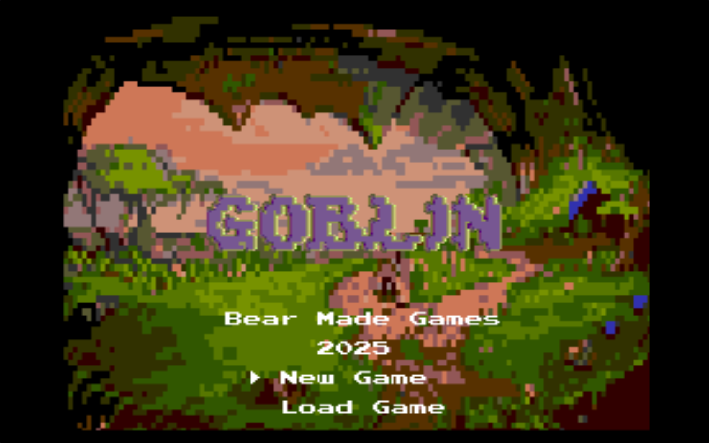

----

###  2D Video Game for Sega Genesis 

----
#### - [TODO/Progress](TODO.md)
----

#### - Summary
----

Goblin will be a 2D rogue-like game for the Sega Genesis created with SGDK, 
Sega Genesis Development Kit. It is targeted towards retro-gaming enthusiasts
and fans of the classic RPGs of the early 90s.

#### - Main Character 

<h1 align = center>

 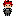 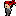 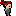 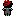
  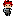 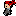 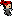 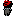

</h1>

#### - Objectives
----

The game will be a procedurally generated top-down exploration game with turn-based combat. 
The Player will be able to walk around a procedurally generated map, fighting random 
battles with goblins, and collecting their remains to sell for gold to merchants.
The Player will then be able to upgrade their character with the gold they collect.

----
#### - Goblins 

<h1 align = center>

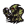   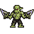  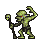 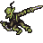 
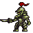  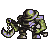  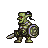 

</h1>

https://opengameart.org/content/10-basic-rpg-enemies-the-goblin-supplement

----

#### - Mechanics
----

The game will feature streamlined mechanics including simple 
top-down movement and menu-driven turn-based combat.

----

#### - Controls 
----
D-pad to move, A B C to select options in battle, start to open menu.

A standard 3 button Sega Genesis controller will be used. 

----

#### - Key Elements
----

Key elements include procedural generation of the map as well as humorous 
procedurally generated battle system messages. The game  will also feature
a stock-market-like system that will allow the player to buy and sell goblin 
remains.

----

#### [- Asset Catalog](AssetCatalogue.md)

----

##### - Credits

###### Made By: Hunter Singleton

----
